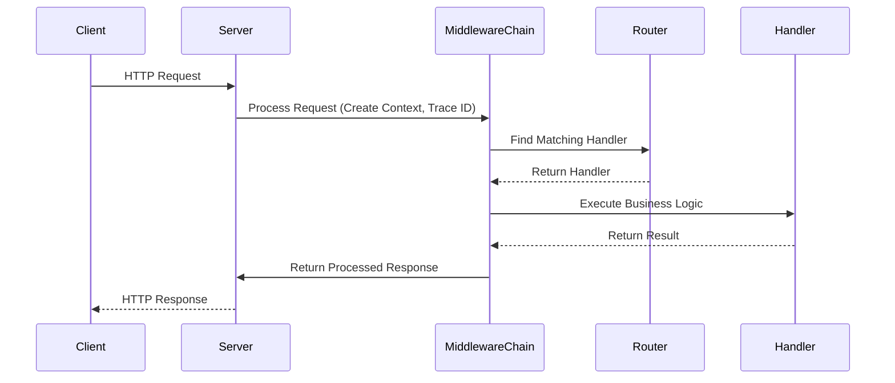

 # Stellane Architecture Overview

> A deep-dive into Stellane's design decisions, execution model, and core components.

---

## 1. Overview

Stellane is a C++20/23/26 backend framework purpose-built for **game servers** and **real-time applications**.  
This document outlines how its core values — **extreme performance**, **developer-first ergonomics**, and **security by design** — are translated into real, scalable software architecture.

This document will help readers understand:
- The modular structure of Stellane
- Key components and how they interact
- The execution lifecycle of a request
- The async debugging strategy using Trace ID & Context
- Architectural trade-offs and rationale

---

## 2. Core Design Philosophy

### 🚀 Uncompromising Performance
- **Zero-cost abstractions**: The entire middleware/handler execution model is based on **non-recursive**, **non-virtual**, **constexpr-aware** logic. All core paths are optimized for inlining.
- **Async-first I/O model**: Stellane supports `std::coroutine`, `Unifex`, and optionally `Boost.Asio`, ensuring minimal overhead across 10k+ concurrent sockets.
- **Prebuilt binaries**: Each template ships with precompiled binaries for native performance and near-zero cold start.

### ✨ Innovative Developer Experience
- Inspired by **NestJS**, Stellane offers a familiar module/controller-style architecture — but for modern C++.
- The **Stellane CLI** provides template scaffolding, project running, and static analysis tools out of the box.
- **Traceable async debugging** is deeply integrated from day 1, reducing time-to-debug by an order of magnitude.

### 🛡️ Secure by Design
- All operations are sudo-free and scoped under `~/.stellane/`, with strict file permissions (`0700` / `0600`).
- Templates are **SHA256 and GPG-verified** at installation.
- Environment variables are read from `.env` files or securely prompted at runtime.

---

## 3. Key Architectural Components

### 3.1. Server
The main entrypoint, responsible for:
- Listening for connections
- Accepting requests and spawning handlers
- Injecting the root Context (Trace ID, metadata)
- Returning the serialized response

```cpp
Server server = Server::create(/* options */);
server.use(/* middleware */);
server.route(/* route config */);
server.listen(8080);
```

⸻

### 3.2. Router

The Router maps HTTP methods and paths to Handler instances.
	•	Fast Trie-based or Regex-based hybrid routing
	•	Allows per-route middleware or global intercept hooks (if ever enabled)
	•	Method-safe (GET/POST separation)
```coo
router.get("/posts/:id", getPostHandler);
router.post("/auth/login", loginHandler);
```

⸻

### 3.3. Middleware Chain

A chain of lightweight functions (Middlewares) run before and after the handler.
	•	No recursion: implemented via iterative loop for performance
	•	Pre-handler and post-handler support
	•	Error propagation via Result<T> or std::expected

```cpp
middleware_chain = {
  LogRequest(),
  RateLimit(),
  AuthGuard(),
  ResponseLogger()
};
```

⸻

### 3.4. Handler

Typed, coroutine-friendly function that contains business logic.
```cpp
Task<Response> getPostHandler(const Request& req, Context& ctx);
```
	•	Parameters are injected
	•	Context carries trace, auth, and per-request metadata
	•	Return type supports co_await and direct Response building

⸻

### 3.5. Context

The Context object:
	•	Is created at the start of the request
	•	Stores the Trace ID, request-scoped values (auth info, timeouts, etc.)
	•	Is passed implicitly across all async boundaries (via coroutine-local storage or explicit forwarding)
```cpp
ctx.set("user_id", 123);
ctx.trace_id(); // "a84e-..."
```

⸻

### 3.6. Tracer

The Tracer system:
	•	Automatically logs all middleware/handler transitions
	•	Emits structured logs with trace_id, timestamp, path, status_code, and optional error details
	•	Logs are saved in ~/.stellane/logs/*.log

⸻

## 4. Request Handling Lifecycle

The following sequence shows how a typical HTTP request is handled:


> Key Notes:
	•	Context is propagated through the entire lifecycle
	•	Middleware is fully deterministic: no side-loading, no magical DI
	•	All logging emits trace_id for correlation

⸻

## 5. Asynchronous Debugging Strategy

### 5.1. Problem Definition

C++’s coroutine-based async code suffers from:
	•	Stack trace loss (no frame history in exceptions)
	•	Difficult context tracing (who initiated this handler?)
	•	Manual logging with inconsistent metadata

### 5.2. Stellane’s Solution
	•	Context Object: Thread-safe, coroutine-local store containing trace_id, request_id, user_id, etc.
	•	Trace ID Injection: All middleware and handler logs include the current trace ID automatically.
	•	Log Lifecycle Events: Each transition (e.g., handler start/end, middleware enter/exit) is logged with high-resolution timestamps.

Benefits:
	•	Easy to debug multi-middleware flows
	•	Works out-of-the-box, no extra config needed
	•	Integratable with external systems (OpenTelemetry coming soon)

⸻

## 6. Key Decisions & Rationale

❌ No Interceptors
	•	Interceptors introduce deep, dynamic stack frames
	•	In most use-cases, middleware + context are sufficient
	•	Simpler control flow → easier debugging

🔁 Non-recursive Middleware
	•	Prevents stack overflow in long chains
	•	Fully loop-based execution → predictable call depth
	•	Easier to optimize and reason about

✅ CLI-First Development
	•	Developers can generate, test, and run services without writing boilerplate
	•	Templates are tightly coupled with the framework spec (via stellane.template.toml)

⸻

## 7. Future Roadmap

Feature	Description
✅ Zenix++ ORM Integration	Context-aware DB layer with connection pooling
🟡 WebSocket Support	Real-time matchmaking, chat, multiplayer
🟡 OpenTelemetry Bridge	Export Trace ID data to Jaeger, Grafana, etc.
🔒 JWT & Session Middleware	Out-of-the-box auth capabilities
📊 Built-in Metrics	Middleware hooks for Prometheus scraping


⸻

📎 Related Documents
	•	README.md
	•	Trace Debugging Guide
	•	Template Registry Spec
	•	CLI Commands

⸻

🧾 License

MIT License. Use freely, modify respectfully.

---
