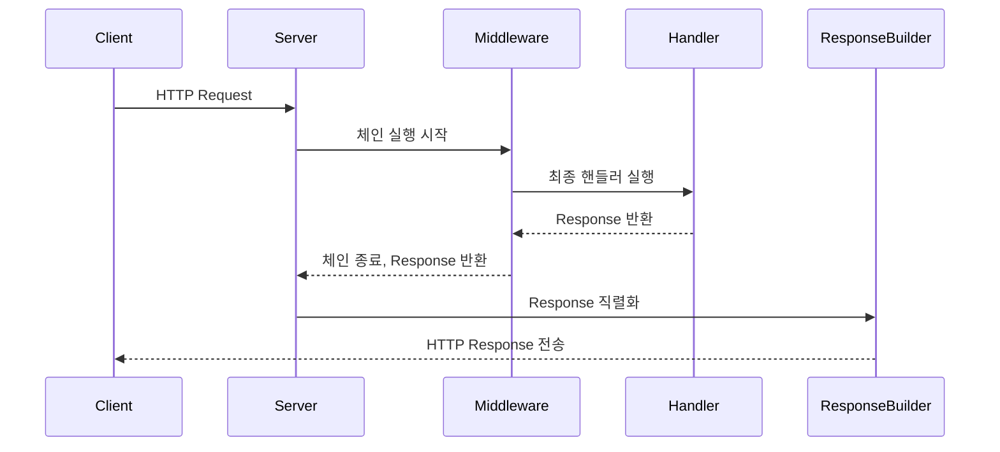

# Response Pipeline in Stellane

> "핸들러에서 생성된 Response는 어떻게 클라이언트에게 전달되는가?"

---

## 1. 개요 (Overview)

Stellane에서 `Response` 객체는 핸들러 또는 미들웨어에서 생성된 응답을 표현하는 핵심 추상화입니다.  
이 문서에서는 이 `Response` 객체가 **어떻게 생성되고**, **어떻게 가공되며**, **최종적으로 HTTP 응답으로 변환되어 전송되는지** 그 전체 파이프라인을 설명합니다.

---

## 2. 응답 생성 흐름 요약 (High-Level Flow)



⸻

## 3. Response 객체의 구조 (Response Object Structure)
```cpp
class Response {
public:
    static Response ok(std::string body);
    static Response created(std::string body);
    static Response not_found(std::string msg);
    static Response internal_server_error(std::string msg);

    Response& with_header(std::string key, std::string value);
    Response& with_status(int status_code);

    int status_code() const;
    const std::string& body() const;
    const std::map<std::string, std::string>& headers() const;
};
```
  •	모든 핸들러는 Task<Response>를 반환합니다.
	•	미들웨어도 next() 호출 이후 ctx를 통해 Response에 접근하거나 변형 가능
	•	Response는 상태코드, 본문, 헤더를 갖는 불변 객체로 설계됩니다

⸻

## 4. 응답 직렬화 (Serialization to Raw HTTP)

핸들러가 반환한 Response 객체는 다음 단계에서 HTTP 응답 메시지 포맷으로 직렬화됩니다.

직렬화 예시
```
HTTP/1.1 200 OK
Content-Type: application/json
Content-Length: 42

{"message": "Created user successfully"}
```
직렬화 단계
	1.	status_code() → HTTP 상태 라인 생성
	2.	headers() → 각 키-값 쌍을 HTTP 헤더로 출력
	3.	body() → Content-Length 자동 계산 후 출력
```cpp
std::string serialize(const Response& res) {
    std::ostringstream out;
    out << "HTTP/1.1 " << res.status_code() << " " << reason_phrase(res.status_code()) << "\r\n";

    for (const auto& [key, value] : res.headers()) {
        out << key << ": " << value << "\r\n";
    }

    out << "Content-Length: " << res.body().size() << "\r\n\r\n";
    out << res.body();

    return out.str();
}
```

⸻

## 5. 후처리 미들웨어 (Post-processing Middleware)

응답은 핸들러 실행 이후에도 미들웨어에 의해 수정될 수 있습니다.
대표적으로 다음과 같은 미들웨어가 존재할 수 있습니다:

미들웨어	역할
🔐 CorsMiddleware	응답에 Access-Control-* 헤더 추가
📊 MetricsMiddleware	응답 상태코드 기록
🧵 TraceMiddleware	Trace-ID 헤더 삽입
```cpp
Task<> CorsMiddleware::handle(const Request&, Context& ctx, const Next& next) {
    co_await next();
    ctx.response().with_header("Access-Control-Allow-Origin", "*");
}
```

⸻

## 6. 오류 처리 (Error → Response 변환)

핸들러나 미들웨어 내에서 예외가 발생하거나, std::unexpected 또는 HttpError가 throw되면
ErrorHandlingMiddleware가 이를 가로채어 표준화된 응답으로 변환합니다.
```cpp
catch (const HttpError& err) {
    ctx.set_response(
        Response::from_status(err.status_code())
                .with_body(err.message())
                .with_header("Content-Type", "application/json")
    );
}
```
> → 이 방식은 응답을 한 지점에서 통일성 있게 제어할 수 있게 합니다.

⸻

## 7. 커스터마이징 가능 지점 (Customizable Hooks)

Stellane은 다음과 같은 후처리 훅을 지원할 수 있습니다 (예정 포함):

훅 종류	위치	목적
onResponse	Server 레벨	모든 응답 직전에 로깅, APM 전송
modifyHeaders	Middleware 레벨	보안 헤더 삽입, CORS
injectCookies	Middleware 레벨	인증 쿠키 삽입


⸻

## 8. 응답 파이프라인에서의 성능 고려 (Performance Considerations)

항목	설명
직렬화 오버헤드	기본적으로 ostringstream를 사용하지만, string_view 및 prealloc buffer로 최적화 예정
Content-Length 자동 계산	payload 크기에 따라 계산됨
커스텀 헤더 수	내부적으로 unordered_map → flat_map으로 변경 시 더 빠른 직렬화 가능


⸻
