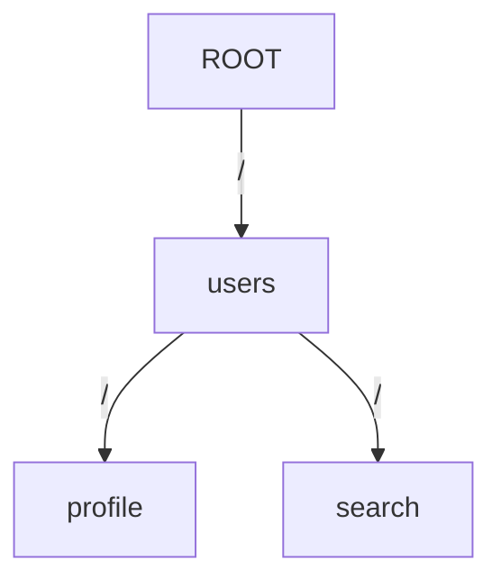

# Stellane's Internal Routing Tree

> 효율성과 유연성의 균형: 하이브리드 라우팅 구조의 모든 것

---

## 1. 개요 (Overview)

이 문서는 Stellane 프레임워크의 라우팅 성능을 뒷받침하는 **내부 자료구조와 알고리즘**에 대해 설명합니다. 단순한 API 매핑을 넘어서, **수백에서 수천 개의 엔드포인트**를 정밀하고 빠르게 처리하기 위한 구조적 설계 철학을 밝힙니다.

### 설계 목표

- 🔄 정적 경로는 O(1) 수준의 빠른 검색
- 🔍 동적 경로는 높은 유연성 제공
- ⚖️ 성능과 기능성의 균형 추구

### 핵심 전략: 하이브리드 라우팅 구조

Stellane은 라우팅 경로를 **정적 경로**와 **동적 경로**로 분리하여, 각 특성에 맞는 최적화된 자료구조로 관리합니다:

- **정적 경로** → `Trie(Prefix Tree)`
- **동적 경로** → `Compiled Regex List`

---

## 2. 핵심 설계: 하이브리드 라우팅 트리

### 2.1 정적 경로 (Static Routes): Trie

#### 이유

- `/users/profile`, `/users/search`처럼 완전히 고정된 경로는 **접두어(Prefix)**를 공유하는 경우가 많습니다.
- 이러한 경로는 `Trie` 구조를 사용하면 **문자 단위 분기**를 통해 빠르게 매칭할 수 있습니다.

#### 예시

Mermaid 다이어그램으로 구조 시각화:


  •	GET /users/profile 요청은 users → profile 노드를 따라 탐색
	•	깊이: 경로의 세그먼트 수, 성능: O(k)

⸻

### 2.2 동적 경로 (Dynamic Routes): 정규식 목록

이유
	•	/users/:id, /posts/:category/:slug와 같은 동적 경로는 트라이에서 구분이 어렵습니다.
	•	따라서 동적 경로는 정규 표현식으로 변환되어 별도 목록으로 관리됩니다.

예시

등록 경로	컴파일된 정규식
/users/:id	^/users/([^/]+)$
/posts/:cat/:slug	^/posts/([^/]+)/([^/]+)$

최적화
	•	서버 시작 시점에 정규식이 미리 컴파일됨
	•	요청마다 재컴파일 없이 컴파일된 Regex 객체를 재사용

⸻

## 3. 라우팅 알고리즘 (The Routing Algorithm)
```
요청: GET /users/123
```
### Step-by-step:
	1.	요청 경로와 메서드를 추출
	2.	정적 경로 우선 검색 (Trie)
	•	GET 메서드의 Trie에서 /users/123 경로를 탐색
	•	실패 시 다음 단계로
	3.	동적 경로 검색 (Regex List)
	•	GET 메서드에 등록된 정규식 목록 순회
	•	첫 번째로 매칭되는 정규식에서 파라미터 추출
	4.	매칭된 핸들러 반환
	•	예: get_user_by_id(Context& ctx, int id) 호출, id = 123
	5.	모든 경로와 불일치 시
	•	404 Not Found 반환

⸻

## 4. 성능 고려사항 (Performance Considerations)

항목	설명
✅ 정적 경로	Trie 구조 덕분에 경로 수에 관계없이 빠름 (O(k))
⚠️ 동적 경로	등록 수(n)에 따라 선형 탐색 (O(n)), 남용 시 주의 필요
✅ 메모리 사용	Trie는 접두어 공유로 메모리 효율적, Regex는 컴파일 캐시 사용
✅ 확장성	수천 개의 정적 경로도 빠르게 처리 가능

요약

> “빈도가 높은 정적 경로는 빠르게, 유연성이 필요한 동적 경로는 안전하게”

⸻

## 5. 의사결정 기록 (Design Rationale)

### Q1. 왜 모든 경로를 정규식으로 처리하지 않았나요?

### A:
성능 때문입니다. 정규식은 표현력은 뛰어나지만, 매 요청마다 모든 패턴을 순차 비교하면 CPU 비용이 큽니다.
반면 Trie는 정적 경로에 한해 비교 연산 없이 직접 노드 탐색으로 매칭이 가능하여 훨씬 빠릅니다.

대부분의 API는 정적 경로로 구성되기 때문에, Trie 기반 구조를 우선시한 것입니다.

### Q2. Trie와 Regex를 결합한 이유는 무엇인가요?

### A:
완전히 정적인 구조는 유연하지 않고, 완전히 정규식 기반은 느리기 때문입니다.
Stellane은 이 둘의 장점을 결합한 하이브리드 모델을 통해
성능 + 유연성 + 유지보수성을 동시에 달성하고자 했습니다.

⸻
